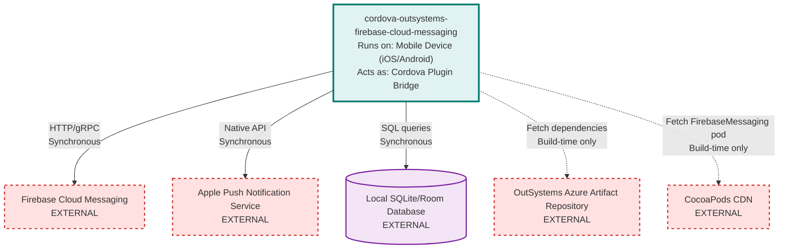

# cordova-outsystems-firebase-cloud-messaging Architecture

> **Repository:** cordova-outsystems-firebase-cloud-messaging
> **Runtime Environment:** Mobile Applications (iOS/Android native code embedded in hybrid apps)
> **Last Updated:** 2026-03-16

## Overview

This is a Cordova/Capacitor plugin that provides Firebase Cloud Messaging (FCM) capabilities to hybrid mobile applications. The plugin runs as native code (Swift on iOS, Kotlin on Android) within the host mobile application, bridging JavaScript calls from the WebView to native Firebase SDK functionality.

## Architecture Diagram

## External Integrations

| External Service | Communication Type | Purpose |
|------------------|-------------------|---------|
| Firebase Cloud Messaging (FCM) | Sync (HTTP/gRPC) | Send/receive push notifications, manage device tokens, subscribe to topics |
| Apple Push Notification Service (APNs) | Sync (Native iOS API) | iOS-specific push notification delivery and APNs token management |
| Local SQLite/Room Database | Sync (SQL) | Store pending notifications locally for retrieval when app is offline or in background |
| OutSystems Azure Artifact Repository | Build-time (Maven) | Fetch proprietary Android AAR libraries (osfirebasemessaging-android, oslocalnotifications-android) |
| CocoaPods CDN | Build-time (CocoaPods) | Fetch Firebase iOS SDK (FirebaseMessaging 10.29.0) |

## Architectural Tenets

### T1. Platform-Specific Implementation with Shared Interface Contract

The plugin maintains separate native implementations for iOS and Android but exposes an identical JavaScript API surface. Each platform implements the same set of methods defined in the JavaScript bridge, ensuring host applications can use the plugin uniformly across platforms while delegating to platform-appropriate FCM SDKs.

**Evidence:**
- `www/OSFirebaseCloudMessaging.js` - Defines common JavaScript API with methods like `getToken`, `subscribe`, `registerDevice`
- `src/ios/OSFirebaseCloudMessaging.swift` (in `OSFirebaseCloudMessaging` class) - Swift implementation delegates to `FirebaseMessagingController` from iOS framework
- `src/android/com/outsystems/firebase/cloudmessaging/OSFirebaseCloudMessaging.kt` (in `OSFirebaseCloudMessaging` class) - Kotlin implementation delegates to `FirebaseMessagingController` from Android AAR
- Both platforms implement identical method signatures (`getToken`, `subscribe`, `unsubscribe`, `registerDevice`) despite using different underlying SDKs

### T2. Abstraction Through Proprietary Native Libraries

Business logic and Firebase SDK interaction are isolated in proprietary native libraries (`OSFirebaseMessagingLib` for iOS, `osfirebasemessaging-android` for Android), not in this plugin's code. This plugin acts as a thin bridge layer that translates Cordova calls to library calls. The proprietary libraries are maintained separately and distributed as compiled artifacts.

**Evidence:**
- `plugin.xml` - References `OSFirebaseMessagingLib.xcframework` (lines 43-44) and `OSLocalNotificationsLib.xcframework` as embedded frameworks
- `src/android/com/outsystems/firebase/cloudmessaging/build.gradle` - Imports `com.github.outsystems:osfirebasemessaging-android:1.3.1@aar` from Azure repository
- `src/ios/OSFirebaseCloudMessaging.swift` (in `pluginInitialize`) - Instantiates `FirebaseMessagingController()` from external framework
- `src/android/com/outsystems/firebase/cloudmessaging/OSFirebaseCloudMessaging.kt` (in `initialize`) - Creates `FirebaseMessagingController` and `FirebaseNotificationManager` from imported AAR

### T3. Event-Driven Callback Pattern with Queue Buffering

The plugin uses an event listener system on the JavaScript side to handle asynchronous FCM events (notification clicks, token refresh). Events triggered before the Cordova device is ready are queued and replayed once the WebView is fully initialized, ensuring no events are lost during app startup.

**Evidence:**
- `www/OSFirebaseCloudMessaging.js` (in `on` and `un` functions) - Implements listener registration/deregistration pattern
- `www/OSFirebaseCloudMessaging.js` (in `fireQueuedEvents`) - Calls native `ready` action to flush queued events
- `src/ios/OSFirebaseCloudMessaging.swift` (in `ready` and `trigger` methods) - Maintains `eventQueue` array and `deviceReady` flag
- `src/android/com/outsystems/firebase/cloudmessaging/OSFirebaseCloudMessaging.kt` (in `ready` and `callbackNotifyApp`) - Uses `eventQueue: MutableList<String>` to buffer JavaScript calls

### T4. Build-Time Hooks for Platform-Specific Configuration

The plugin relies on Cordova/Capacitor build hooks to inject platform-specific configurations that cannot be expressed in static plugin descriptors. Hooks copy notification channel metadata, unzip custom sound files, modify AppDelegate/build.gradle files, and adapt to different build environments (Cordova vs. Capacitor).

**Evidence:**
- `plugin.xml` - Declares hooks: `after_prepare` hooks for `unzipSound.js`, `cleanUp.js`, `androidCopyChannelInfo.js`, `iOSCopyPreferences.js`
- `hooks/android/androidCopyChannelInfo.js` - Reads notification channel preferences from `config.xml` and writes to Android strings resource
- `hooks/unzipSound.js` - Extracts `sounds.zip` to platform-specific resource directories during build
- `build-actions/capacitor_hooks_update_after.js` (in `updateAppDelegate` function) - Injects Firebase delegate calls into iOS AppDelegate for Capacitor apps
- `package.json` - Defines `capacitor:update:after` script to handle Capacitor-specific build modifications

### T5. Permission Abstraction with Version-Aware Logic

The plugin abstracts runtime permission handling across different Android API levels, treating pre-Tiramisu (API 33) and post-Tiramisu behavior uniformly. iOS permission handling is always asynchronous. This allows consuming apps to call `registerDevice` without platform-specific conditional logic.

**Evidence:**
- `src/android/com/outsystems/firebase/cloudmessaging/OSFirebaseCloudMessaging.kt` (in `registerDevice`) - Checks `Build.VERSION.SDK_INT < Build.VERSION_CODES.TIRAMISU` to determine if POST_NOTIFICATIONS permission is required
- `src/android/com/outsystems/firebase/cloudmessaging/OSFirebaseCloudMessaging.kt` (in `registerDevice`) - Uses `MutableSharedFlow` to convert Cordova permission callback to suspend function
- `src/android/com/outsystems/firebase/cloudmessaging/OSFCMPermissionEvents.kt` - Sealed class models permission result states (`Granted`, `NotGranted`)
- `src/ios/OSFirebaseCloudMessaging.swift` (in `registerDevice`) - Always calls `requestAuthorisation()` and checks result asynchronously

## Current Phase Constraints

### Capacitor Migration Strategy

The plugin currently supports both Cordova and Capacitor build systems using conditional logic. Cordova apps use method swizzling in AppDelegate, while Capacitor apps require hook-injected code modifications.

**Evidence:**
- `src/ios/AppDelegate+OSFirebaseCloudMessaging.m` - Uses runtime method swizzling but returns early if Capacitor bridge is detected
- `build-actions/capacitor_hooks_update_after.js` - Injects AppDelegate modifications specifically for Capacitor apps

**Expires when:** Cordova support is officially deprecated and all consuming apps migrate to Capacitor.
